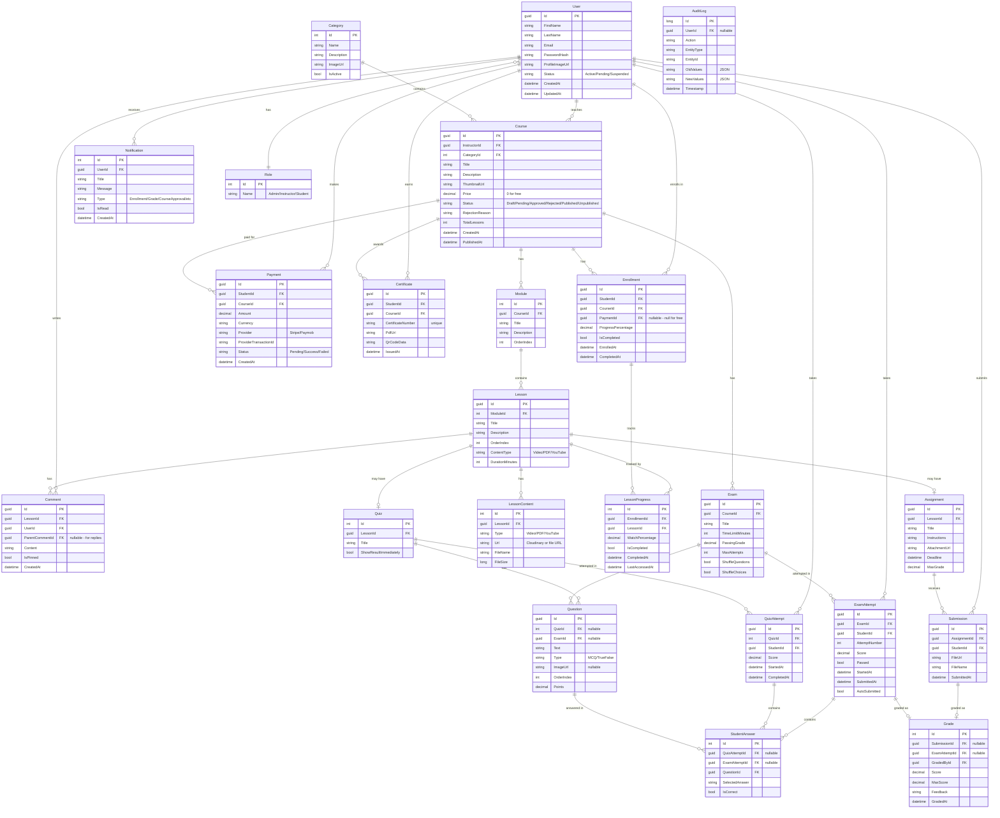
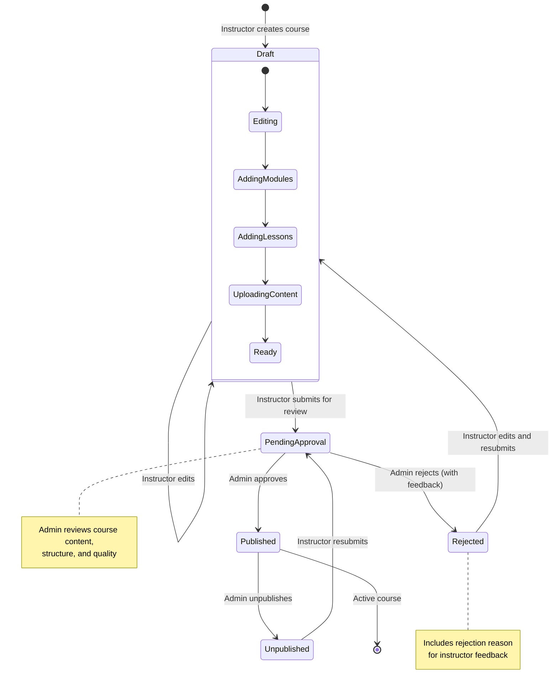
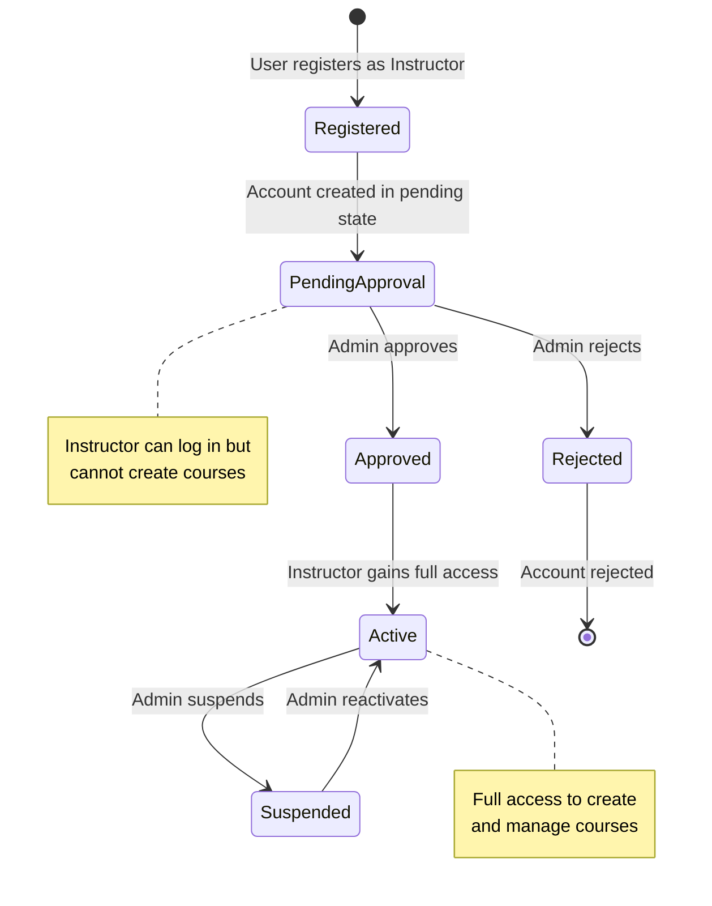
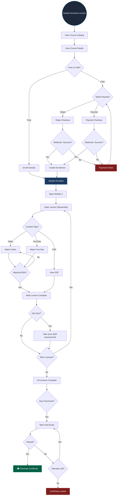
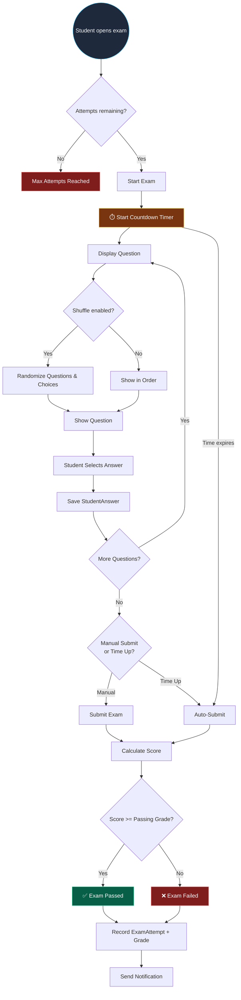
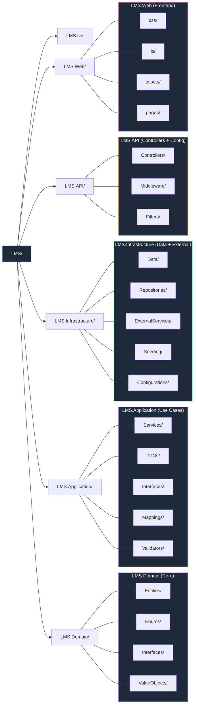
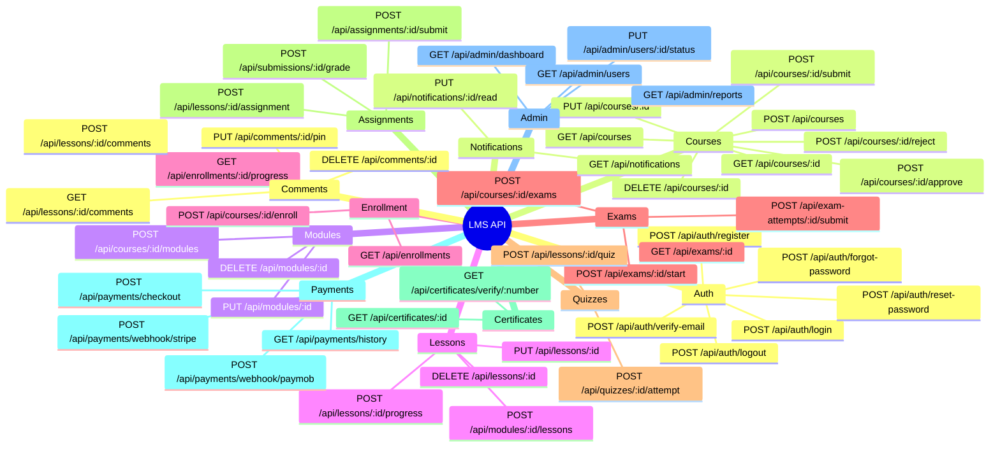

# LMS + Online Exams — System Design

## 1. High-Level System Architecture

```mermaid
graph TB
    subgraph Client["Client Layer (Vanilla JS)"]
        WEB["Web Application<br/>HTML / CSS / JS"]
    end

    subgraph API["API Layer (ASP.NET Core)"]
        GW["API Gateway / Middleware"]
        AUTH["Auth Controller"]
        COURSE["Course Controller"]
        LESSON["Lesson Controller"]
        ENROLL["Enrollment Controller"]
        EXAM["Exam Controller"]
        QUIZ["Quiz Controller"]
        ASSIGN["Assignment Controller"]
        CERT["Certificate Controller"]
        PAY["Payment Controller"]
        ADMIN["Admin Controller"]
        COMMENT["Comment Controller"]
        NOTIFY["Notification Controller"]
    end

    subgraph Services["Service / Application Layer"]
        AUTH_SVC["Auth Service"]
        COURSE_SVC["Course Service"]
        LESSON_SVC["Lesson Service"]
        ENROLL_SVC["Enrollment Service"]
        EXAM_SVC["Exam Service"]
        QUIZ_SVC["Quiz Service"]
        ASSIGN_SVC["Assignment Service"]
        CERT_SVC["Certificate Service"]
        PAY_SVC["Payment Service"]
        PROGRESS_SVC["Progress Service"]
        ADMIN_SVC["Admin Service"]
        COMMENT_SVC["Comment Service"]
        NOTIFY_SVC["Notification Service"]
        AUDIT_SVC["Audit Service"]
    end

    subgraph Data["Data Layer"]
        DB[("SQL Server<br/>EF Core")]
        CLOUD["Cloudinary<br/>(Videos / Images)"]
        FILE["File Storage<br/>(PDFs / Docs)"]
    end

    subgraph External["External Services"]
        STRIPE["Stripe API"]
        PAYMOB["Paymob API"]
        EMAIL["Email Service<br/>(SMTP / SendGrid)"]
    end

    WEB <-->|HTTP / REST| GW
    GW --> AUTH & COURSE & LESSON & ENROLL & EXAM & QUIZ & ASSIGN & CERT & PAY & ADMIN & COMMENT & NOTIFY

    AUTH --> AUTH_SVC
    COURSE --> COURSE_SVC
    LESSON --> LESSON_SVC
    ENROLL --> ENROLL_SVC
    EXAM --> EXAM_SVC
    QUIZ --> QUIZ_SVC
    ASSIGN --> ASSIGN_SVC
    CERT --> CERT_SVC
    PAY --> PAY_SVC
    ADMIN --> ADMIN_SVC
    COMMENT --> COMMENT_SVC
    NOTIFY --> NOTIFY_SVC

    AUTH_SVC & COURSE_SVC & LESSON_SVC & ENROLL_SVC & EXAM_SVC & QUIZ_SVC & ASSIGN_SVC & CERT_SVC & PAY_SVC & PROGRESS_SVC & ADMIN_SVC & COMMENT_SVC & NOTIFY_SVC & AUDIT_SVC --> DB

    LESSON_SVC --> CLOUD
    COURSE_SVC --> CLOUD
    ASSIGN_SVC --> FILE
    LESSON_SVC --> FILE
    PAY_SVC --> STRIPE & PAYMOB
    AUTH_SVC --> EMAIL
    NOTIFY_SVC --> EMAIL
    CERT_SVC --> FILE

    style Client fill:#1e293b,stroke:#38bdf8,color:#f8fafc
    style API fill:#1e293b,stroke:#818cf8,color:#f8fafc
    style Services fill:#1e293b,stroke:#a78bfa,color:#f8fafc
    style Data fill:#1e293b,stroke:#34d399,color:#f8fafc
    style External fill:#1e293b,stroke:#fb923c,color:#f8fafc
```

---

## 2. Entity Relationship Diagram

---

## 3. Course State Machine

---

## 4. Instructor Account Approval Flow

---

## 5. Student Enrollment & Learning Flow

---

## 6. Exam Taking Flow

---

## 7. Project Folder Structure

---

## 8. API Endpoint Map

